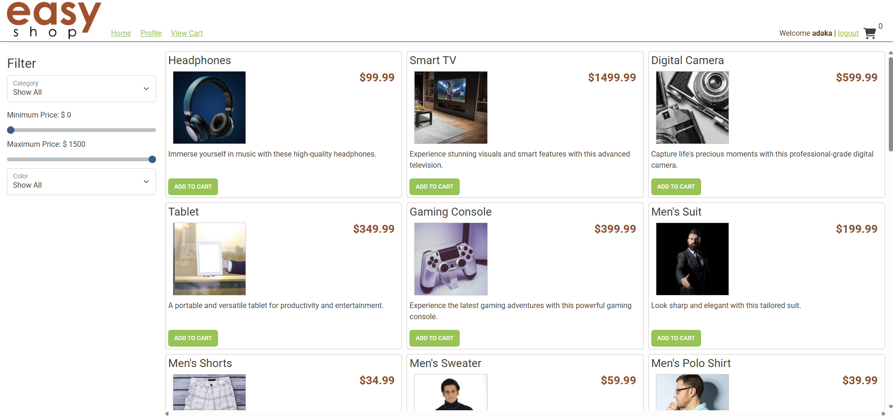
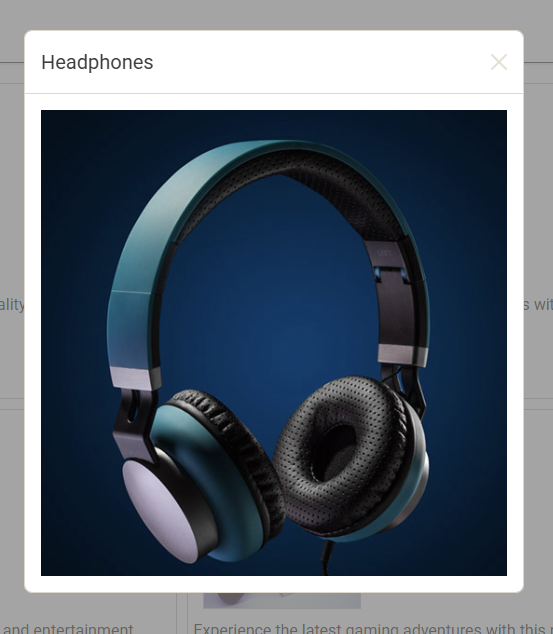
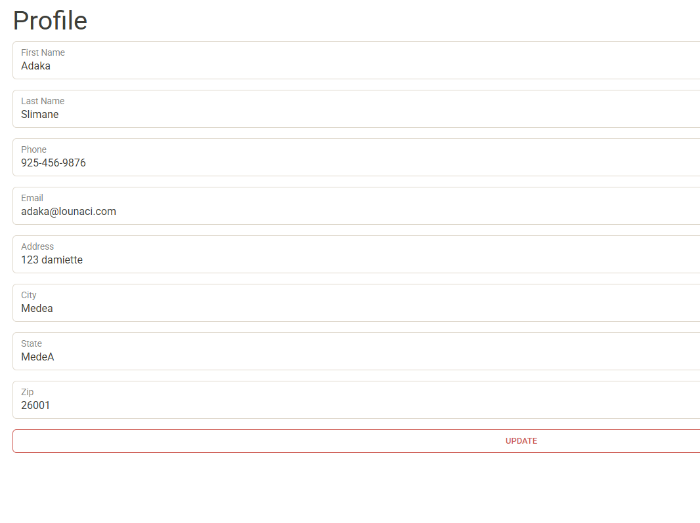
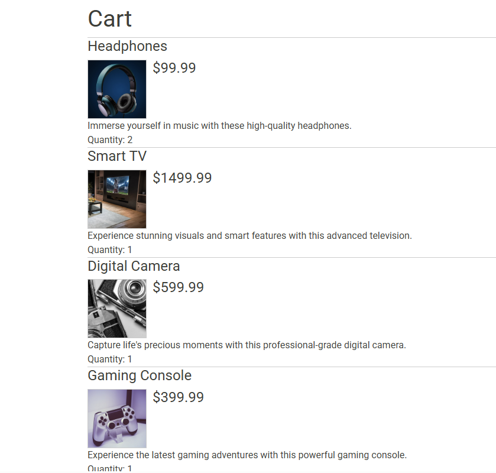

# 🛒 E-Commerce Web Application Backend

This project is a **robust Spring Boot backend** powering a full-stack e-commerce web application. Built as a capstone for backend engineering training, it features modern best practices for **secure, testable, and scalable web APIs**.

---

*Homepage displaying featured products*

---

## 🚀 Project Overview

This is a backend system for a shopping platform, enabling users to browse products, manage their cart, update profile info, and check out. The admin can manage products and categories.

> **Capstone Scope**: Built as a part of the Year Up United Software Development curriculum — no deployment or authentication UI required, but full backend functionality implemented with realistic constraints.

---

## ✨ Features

- ✅ **JWT-based login/registration**
- ✅ **Spring Security with role-based access**
- ✅ **Product catalog with categories**
- ✅ **User profile view/update**
- ✅ **Persistent shopping cart**
- ✅ **Order creation/checkout**
- ✅ **PostgreSQL integration with JPA**
- ✅ **Comprehensive unit & repository testing**

---

## 📷 UI Previews

| Product View | Shopping Cart | Profile Update |
|--------------|----------------|----------------|
|  |  |  |

---

## 🔧 Technologies Used

- Java 21
- Spring Boot 3.3.x
- Spring Security (JWT)
- Spring Data JPA
- PostgreSQL
- Maven
- JUnit 5 + Mockito
- Thymeleaf (for frontend templates)
- JavaScript / Axios (Frontend API calls)

---

## 🛠️ API Endpoints

### 🔐 Authentication

| Method | URL        | Description          |
|--------|------------|----------------------|
| POST   | `/register` | User registration    |
| POST   | `/login`    | Login & receive token |

### 👤 Profile

| Method | URL       | Description          |
|--------|-----------|----------------------|
| GET    | `/profile` | Get current profile  |
| PUT    | `/profile` | Update profile       |

### 📦 Products & Categories

| Method | URL                         | Description              |
|--------|-----------------------------|--------------------------|
| GET    | `/products`                 | List all products        |
| GET    | `/categories`              | List all categories      |
| GET    | `/categories/{id}/products`| Products by category     |

### 🛒 Shopping Cart

| Method | URL                              | Description                 |
|--------|----------------------------------|-----------------------------|
| GET    | `/cart`                          | View cart                   |
| POST   | `/cart/products/{productId}`     | Add product to cart         |
| PUT    | `/cart/products/{productId}`     | Update product quantity     |
| DELETE | `/cart`                          | Clear cart                  |

### 🧾 Orders

| Method | URL      | Description        |
|--------|-----------|--------------------|
| POST   | `/orders` | Checkout/Place order |

---

## 🧪 Testing

### ✅ Unit & Integration Tests

- **Controllers** tested with `@WebMvcTest` and `MockMvc`
- **Repositories** tested with `@DataJpaTest` and in-memory H2
- Simple coverage for:
    - User Registration
    - Profile Retrieval/Update
    - Product Queries
    - Shopping Cart Persistence
    - Order Creation Logic

---

## 🗂️ Folder Structure

